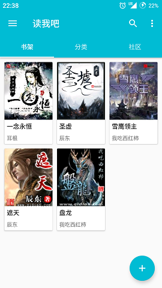
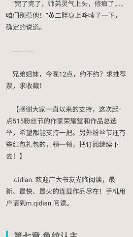
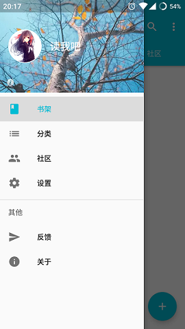

# 读我吧ReadMe

> 一款遵循 Meterial Design 设计的Android App 
> 界面简约 清爽 给你不一样的阅读体验 
> 小说内容均来源于网络采集（使用开源项目 Jsoup 爬取） 
> 如果涉及版权问题，请联系zhang961129@outlook.com
>  
> 新手练手项目

### 版本特点 ###
- Meterial Design UI
- 阅读本地与网络上的书籍
- 最低支持 **SDK 21**, _但是使用了AppCompat ;-)_

### 使用的开源库︰
- [**Android Support Libraries**] (https://developer.android.google.cn/index.html)
- [**ButterKnife**](https://github.com/JakeWharton/butterknife)
- [**Jsoup**](https://github.com/jhy/jsoup)

### 截图（旧版本） ###
  
 

# 开源协议

    Copyright (C) 2017 Zhang <zhang961129@outlook.com>

    Licensed under the Apache License, Version 2.0 (the "License");
    you may not use this file except in compliance with the License.
    You may obtain a copy of the License at

       http://www.apache.org/licenses/LICENSE-2.0

    Unless required by applicable law or agreed to in writing, software
    distributed under the License is distributed on an "AS IS" BASIS,
    WITHOUT WARRANTIES OR CONDITIONS OF ANY KIND, either express or implied.
    See the License for the specific language governing permissions and
    limitations under the License.
